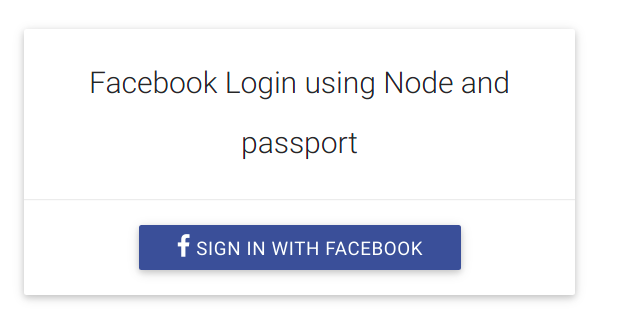

## Facebook login using passport and node JS.



This is a sample project to start with Facebook authentication using nodeJS. 

### How to start 

1. Clone the repository https://github.com/ArslanRama/Nodejs_Facebook_Auth_Passport

2. Open the repository in your terminal
cd Nodejs_Facebook_Auth_Passport\

3. Enter the follwoing command 
npm install

4. Open the file `config.js` in your code editor and replace the follwoing <APP_ID> and <APP_SECRET> with your Facebook app id and secret.

`````` JS
module.exports = {
  'facebookAuth': {
    'clientID': '<APP_ID>', // your App ID 
    'clientSecret': '<APP_SECRET>', // your App Secret
    'callbackURL': 'http://localhost:3000/auth/facebook/callback'
  }
}

``````
5. Then run the follwoing command in your terminal

```
npm start (Install nodemon module first)
```